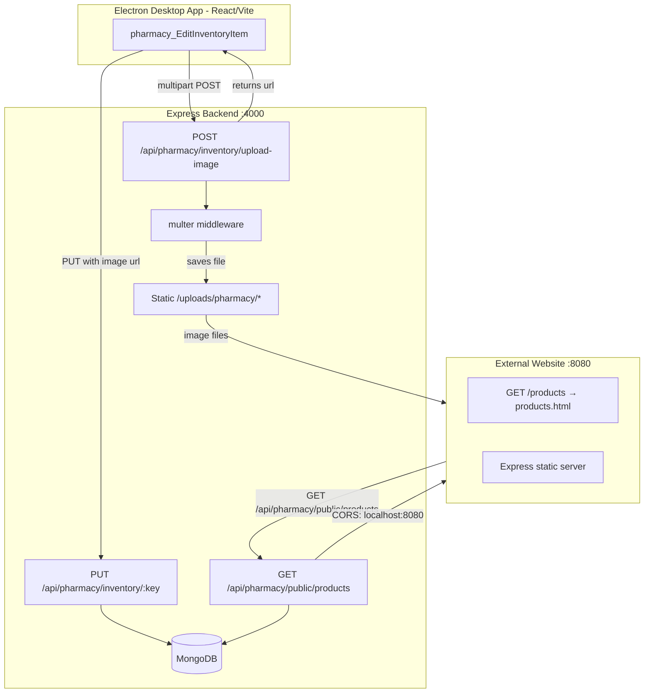

# Design Document: Pharmacy Inventory Image

## Overview

This feature adds image support to pharmacy inventory items across three surfaces:

1. **Backend** — a `POST /api/pharmacy/inventory/upload-image` endpoint (multer, stored under `/uploads/pharmacy/`), updates to the existing `PUT /api/pharmacy/inventory/:key` route to persist the `image` field, and a fully-implemented `GET /api/pharmacy/public/products` endpoint with CORS for `localhost:8080`.
2. **Desktop app (Electron/React)** — the existing `pharmacy_EditInventoryItem` dialog gains a file input, image preview, and remove button replacing the plain URL text input.
3. **External website** — a standalone HTML/CSS/JS page served by a lightweight Express server on port 8080, displaying medicine cards with images fetched from the public products API.

The `InventoryItem` model already has `image: String` and `description: String` fields. The `publicProducts` controller and route stub already exist. The `update` controller already handles `image` in the request body. The work is therefore additive: wire up multer, complete the public API, add CORS, build the image UI in the edit dialog, and create the external website.

---

## Architecture



---

## Components and Interfaces

### Backend: Upload Middleware (`multer`)

`multer` is not yet in `backend/package.json` and must be added. Configuration:

- `dest`: `uploads/pharmacy/` (relative to backend working directory, i.e. `backend/uploads/pharmacy/`)
- `limits.fileSize`: 5 MB (5 × 1024 × 1024 bytes)
- `fileFilter`: accept only `image/jpeg`, `image/png`, `image/webp`, `image/gif`

A new controller file `backend/src/modules/pharmacy/controllers/upload.controller.ts` handles the route logic and returns `{ url: '/uploads/pharmacy/<filename>' }`.

### Backend: Static File Serving

In `backend/src/app.ts`, add:

```ts
app.use('/uploads/pharmacy', express.static(path.join(__dirname, '..', '..', 'uploads', 'pharmacy')))
```

This must be registered **before** the API router so it is not caught by the catch-all SPA handler.

### Backend: CORS for localhost:8080

The existing CORS setup uses `env.NODE_ENV === 'development' ? true : env.CORS_ORIGIN`. In development this already allows all origins. For production, `CORS_ORIGIN` must include `http://localhost:8080`. To make this explicit and reliable regardless of environment, the public products route gets its own CORS middleware:

```ts
import cors from 'cors'
r.get('/public/products', cors({ origin: 'http://localhost:8080', credentials: false }), InventoryItems.publicProducts)
```

### Backend: publicProducts Controller

The stub already exists and is fully implemented (search, limit, field projection). No changes needed to the controller logic itself — only the CORS header addition via route-level middleware.

### Backend: PUT /inventory/:key

The `update` controller already handles `image` correctly:
- `if (image !== undefined) doc.image = image || undefined` — sets, clears (empty string/null → undefined), or leaves unchanged (field absent).

No changes needed to the controller.

### Frontend: pharmacy_EditInventoryItem

Replace the plain `<input type="text">` for Image URL with a richer image management section:

- **Image preview**: shows a thumbnail if `image` is non-empty
- **File input** (`<input type="file" accept="image/jpeg,image/png,image/webp,image/gif">`): triggers upload to `POST /api/pharmacy/inventory/upload-image`
- **Remove button**: clears the `image` state
- **Upload error**: inline error message, dialog stays open
- **Upload loading state**: button disabled during upload

The `pharmacyApi` utility needs a new method `uploadInventoryImage(file: File): Promise<{ url: string }>`.

### External Website

A minimal Express server (`website/server.js`) serves static files from `website/public/`. The main page is `website/public/products.html` — a single HTML file with embedded CSS and vanilla JS that:

1. Fetches `http://localhost:4000/api/pharmacy/public/products` on load
2. Renders medicine cards in a responsive grid
3. Shows a placeholder SVG when `image` is absent
4. Shows "no products" or error states

The server listens on port 8080 and serves `products.html` at `/products`.

---

## Data Models

### InventoryItem (existing, no changes)

```ts
{
  key: string          // normalized lowercase name, unique
  name: string
  genericName?: string
  manufacturer?: string
  category?: string
  brand?: string
  description?: string
  image?: string       // HTTPS URL or Base64 data URI
  onHand: number
  lastSalePerUnit: number
  unitsPerPack: number
  // ...other fields
}
```

### Upload Response

```ts
{ url: string }  // e.g. "/uploads/pharmacy/abc123.jpg"
```

### Public Products Response

```ts
{
  items: Array<{
    name: string
    category?: string
    genericName?: string
    manufacturer?: string
    brand?: string
    description?: string
    image?: string
    onHand: number
    lastSalePerUnit: number
    unitsPerPack: number
  }>
}
```

---

## Correctness Properties

*A property is a characteristic or behavior that should hold true across all valid executions of a system — essentially, a formal statement about what the system should do. Properties serve as the bridge between human-readable specifications and machine-verifiable correctness guarantees.*

### Property 1: Image field persistence round-trip

*For any* valid image string (HTTPS URL or Base64 data URI), if a `PUT /api/pharmacy/inventory/:key` request is made with that image value, then a subsequent `GET /api/pharmacy/inventory` for that item SHALL return the same image value.

**Validates: Requirements 1.2**

### Property 2: Image field preservation on unrelated updates

*For any* inventory item with an existing image value, if a `PUT /api/pharmacy/inventory/:key` request is made that does not include an `image` field, the item's image value SHALL remain unchanged.

**Validates: Requirements 1.4**

### Property 3: Upload endpoint accepts only valid MIME types

*For any* file upload to `POST /api/pharmacy/inventory/upload-image`, the endpoint SHALL return HTTP 200 with a `url` field if and only if the file's MIME type is one of `image/jpeg`, `image/png`, `image/webp`, or `image/gif`; for all other MIME types it SHALL return HTTP 400.

**Validates: Requirements 2.2, 2.4**

### Property 4: Public API returns only in-stock items

*For any* database state containing a mix of items with `onHand > 0` and `onHand <= 0`, the `GET /api/pharmacy/public/products` endpoint SHALL return only items where `onHand > 0`.

**Validates: Requirements 3.2**

### Property 5: Public API response shape

*For any* in-stock inventory item returned by `GET /api/pharmacy/public/products`, the item object SHALL contain all of the fields: `name`, `category`, `genericName`, `manufacturer`, `brand`, `description`, `image`, `onHand`, `lastSalePerUnit`, and `unitsPerPack`.

**Validates: Requirements 3.3**

### Property 6: Public API search filter correctness

*For any* search string `q` and any inventory state, every item returned by `GET /api/pharmacy/public/products?search=q` SHALL match `q` (case-insensitively) in at least one of: `name`, `category`, `genericName`, `manufacturer`, or `brand`.

**Validates: Requirements 3.4**

### Property 7: Public API limit enforcement

*For any* integer `n` in [1, 500], `GET /api/pharmacy/public/products?limit=n` SHALL return at most `n` items.

**Validates: Requirements 3.5**

### Property 8: Product card renders required fields

*For any* product object with non-empty `name`, `category`, `description`, and `lastSalePerUnit`, the rendered product card HTML SHALL contain each of those values as visible text.

**Validates: Requirements 4.4**

### Property 9: Product card image display

*For any* product object, the rendered product card SHALL contain an `` element with `src` equal to the product's `image` value when `image` is a non-empty string, and SHALL contain a placeholder element when `image` is absent or empty.

**Validates: Requirements 4.2, 4.3**

---

## Error Handling

| Scenario | Response |
|---|---|
| Upload: file > 5 MB | HTTP 400 `{ error: 'File too large. Maximum size is 5 MB.' }` |
| Upload: unsupported MIME type | HTTP 400 `{ error: 'Unsupported file type. Allowed: jpeg, png, webp, gif.' }` |
| Upload: no file attached | HTTP 400 `{ error: 'No image file provided.' }` |
| PUT inventory: item not found | HTTP 404 `{ error: 'Item not found' }` (existing behavior) |
| Public API: DB error | HTTP 500 `{ error: 'Internal server error' }` |
| External website: fetch fails | Display inline error banner: "Failed to load products. Please try again." |
| External website: empty results | Display message: "No products currently available." |
| Edit dialog: upload fails | Inline error below file input, dialog stays open |

Multer's built-in error for `LIMIT_FILE_SIZE` is caught in the upload controller and mapped to the 400 response above.

---

## Testing Strategy

### Unit Tests

- `upload.controller.ts`: test file filter logic (valid/invalid MIME types), size limit rejection, successful upload response shape
- `inventory_items.controller.ts` — `update`: test image field set, clear (empty string), clear (null), and absent (no change)
- `inventory_items.controller.ts` — `publicProducts`: test search filter, limit clamping, field projection
- `pharmacy_EditInventoryItem.tsx`: test image preview renders when image is set, file input present, remove button clears image, upload error shown without closing dialog

### Property-Based Tests

Using **fast-check** (TypeScript-compatible, works in both Node and browser test environments).

Each property test runs a minimum of **100 iterations**.

Tag format: `Feature: pharmacy-inventory-image, Property {N}: {property_text}`

- **Property 1** — Generate arbitrary valid image strings (URL and data URI), PUT then GET, assert round-trip equality
- **Property 2** — Generate arbitrary image strings, set on item, PUT without image field, assert image unchanged
- **Property 3** — Generate arbitrary files with random MIME types, assert accept/reject matches allowed list
- **Property 4** — Generate arbitrary inventory arrays with random `onHand` values, assert all returned items have `onHand > 0`
- **Property 5** — Generate arbitrary in-stock items, assert all required fields present in response
- **Property 6** — Generate arbitrary search strings and inventory data, assert all results match search in at least one field
- **Property 7** — Generate arbitrary limit values in [1, 500], assert response length ≤ limit
- **Property 8** — Generate arbitrary product objects, render card, assert all required fields visible
- **Property 9** — Generate arbitrary products with/without image, render card, assert img src or placeholder

### Integration Tests

- Upload a real file, then GET `/uploads/pharmacy/<filename>`, assert 200 (Requirement 2.5)
- GET `/api/pharmacy/public/products` without auth headers, assert 200 (Requirement 3.1)
- GET `/api/pharmacy/public/products` with `Origin: http://localhost:8080`, assert `Access-Control-Allow-Origin` header (Requirement 3.6)

### Smoke Tests

- Backend starts and `/health` returns 200
- `/uploads/pharmacy/` static route is registered
- External website server starts and `/products` returns 200
